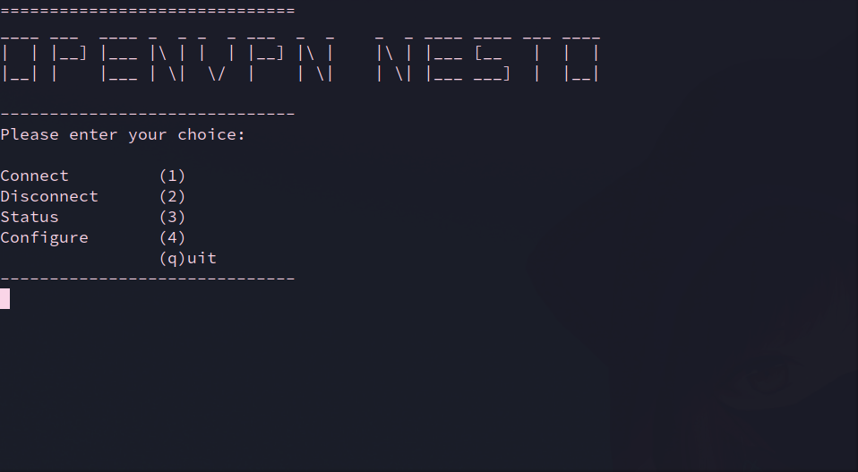

# OpenVPN3 CLI Tool

## Requirements

- openvpn3

## Installation

### In General

- Download the script: `git clone https://github.com/nesto-software/openvpn-nesto-cli.git`
- Execute script: `./openvpn-nesto-cli/openvpn-nesto`

### NixOS (Flake)

Add it to flake inputs:

```
inputs.openvpn-nesto-cli = {
  url = "github:nesto-software/openvpn-nesto-cli";
};
```

Add it to outputs:

```
outputs =
  {
    self,
    home-manager,
    openvpn-nesto-cli,
    # other flake outputs
    ...
  }@inputs:

  {
    nixosConfigurations.<user> = nixpkgs.lib.nixosSystem {
      modules = [
        # modules
      ];
      specialArgs = {
        inherit inputs;
      };
    };
  };
```

Add the flake to your installed packages (I have installed it as a home-manager package):

```
{
  pkgs,
  inputs,
  ...
}:

{
  home.packages = with pkgs; [
    inputs.openvpn-nesto-cli.packages.${pkgs.system}.default
    # other packages
  ];
}
```

## Usage

- To CONNECT press: 1, c or C.  
  If you have not provided a OpenVPN config file you will be prompted to enter
  to your config file (\<path\>/\<filename\>.ovpn)
- to DISCONNECT press: 2, d or D  
  If you have multiple active sessions only one of them will be closed.
  In order to close e.g. 3 sessions you need to press 'disconnect' three times.
- to show STATUS press: 3, s, S
- to CONFIGURE press: 4  
  Use this option to change (the path to) your config file.
- to QUIT press: q or Q

## Preview



## Other

Create a shortcut with a command like
`exec alacritty -e ~/Documents/scripts/openvpn-nesto-cli/openvpn-nesto`.
This will open a terminal and run the script in it.
Replace `alacritty` with whatever terminal you are using and
`~/Documents/scripts/openvpn-nesto-cli/openvpn-nesto` with the path to the script
on your machine.

## Author

`Amon <amon.felbermayer@nesto-software.de`  
License: MIT
